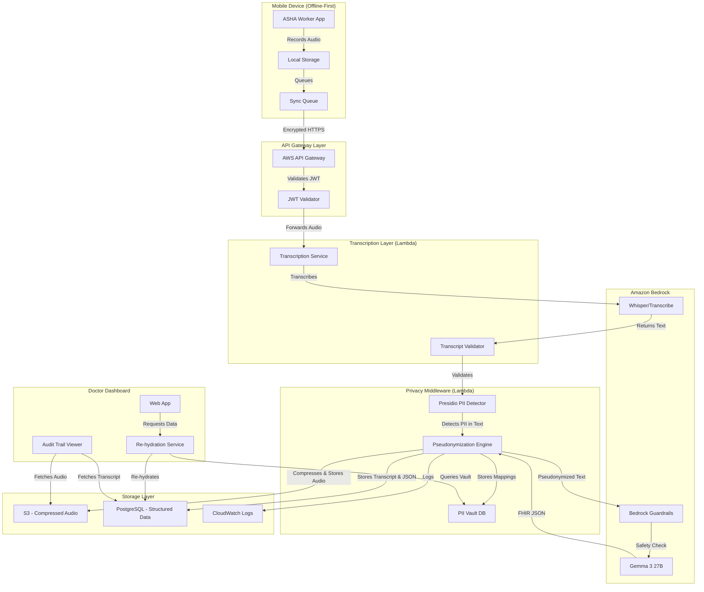

# Design Document: GramSahay AI Clinical Scribe

## Overview

GramSahay AI is a privacy-first clinical documentation system that transforms voice notes from ASHA workers into structured FHIR-compliant medical records. The system employs a two-stage AI processing pipeline: (1) speech-to-text transcription using OpenAI Whisper or Amazon Transcribe on Amazon Bedrock, followed by (2) structured data extraction using Google Gemma 3 (27B) Instruct.

The architecture uses defense-in-depth privacy with dual-layer PII protection: Presidio-based pseudonymization middleware (primary) operating on transcribed text, and Amazon Bedrock Guardrails as a safety net that blocks ANY detected PII before it reaches the AI model.

The system is built on Amazon Bedrock for infinite scalability and enterprise-grade security. A "Glass Box Audit Trail" maintains three synchronized data layers (compressed audio, verbatim transcript, FHIR R4-compliant JSON) to enable human-in-the-loop verification and eliminate unchecked AI hallucinations.

### Key Design Principles

1. **Privacy by Design**: PII never reaches the AI model in its original form
2. **Defense in Depth**: Dual-layer PII protection (Presidio middleware + Bedrock Guardrails safety net)
3. **Two-Stage AI Processing**: Transcription first, then structured extraction from text
4. **Auditability**: Complete traceability from audio to structured data
5. **Offline-First**: Mobile app functions without connectivity for recording and viewing cached data
6. **Scalability**: Serverless architecture scales from 100 to 1M+ users
7. **Zero Trust**: Every component validates and logs all operations

## Architecture

### System Components



### Data Flow

1. **Recording Phase**: ASHA worker records audio → Stored locally with encryption
2. **Upload Phase**: Device syncs via encrypted HTTPS → API Gateway validates JWT → Forwards to transcription layer
3. **Transcription Phase**: Audio sent to Whisper/Transcribe on Bedrock → Returns verbatim text transcript → Validates transcript is non-empty
4. **Pseudonymization Phase**: Presidio detects PII in transcript text → Generates UUIDs → Stores mappings → Replaces PII
5. **AI Processing Phase**: Bedrock Guardrails validates (safety net) → Gemma 3 extracts structured FHIR data from pseudonymized text → Returns FHIR R4 JSON
6. **Storage Phase**: Audio compressed (FLAC/Opus) and sent to S3 with lifecycle policies → Transcript + FHIR JSON to PostgreSQL → Audit log to CloudWatch
7. **Review Phase**: Doctor requests data → Re-hydration service queries vault → Returns original identifiers
8. **Audit Phase**: Doctor views audit trail → Fetches compressed audio from S3 → Displays side-by-side with transcript/FHIR JSON

## Components and Interfaces

### 1. Mobile Application (React Native)

**Responsibilities**:

- Audio recording with visual feedback
- Local storage with AES-256 encryption
- Offline queue management
- JWT token management
- Encrypted HTTPS transmission

**Note**: All processing (transcription, PII detection, AI extraction) happens server-side. The mobile app is primarily for capture and display. Offline capabilities are limited to recording audio and viewing cached patient records.

**Key Interfaces**:

```typescript
interface AudioRecorder {
  startRecording(): Promise<void>;
  stopRecording(): Promise<AudioFile>;
  getRecordingStatus(): RecordingStatus;
}

interface SyncQueue {
  enqueue(audio: AudioFile): Promise<void>;
  sync(): Promise<SyncResult[]>;
  getQueueStatus(): QueueStatus;
}

interface AuthService {
  login(username: string, password: string): Promise<JWTToken>;
  refreshToken(): Promise<JWTToken>;
  logout(): void;
}

interface SecureStorage {
  storeAudio(audio: AudioFile): Promise<void>;
  retrieveAudio(id: string): Promise<AudioFile>;
  encrypt(data: Buffer): Promise<Buffer>;
  decrypt(data: Buffer): Promise<Buffer>;
}
```

### 2. API Gateway (AWS API Gateway + Lambda Authorizer)

**Responsibilities**:

- JWT validation
- Rate limiting
- Request routing
- CORS handling

**Key Interfaces**:

```typescript
interface JWTValidator {
  validateToken(token: string): Promise<TokenPayload>;
  extractRole(payload: TokenPayload): UserRole;
}

interface RateLimiter {
  checkLimit(userId: string): Promise<boolean>;
  incrementCounter(userId: string): Promise<void>;
}
```

### 3. Pseudonymization Middleware (Python Lambda)

**Responsibilities**:

- Audio transcription using Whisper/Transcribe on Bedrock
- Transcript validation
- PII detection using Presidio on transcript text
- UUID generation for entities
- Mapping storage in PII Vault
- Bedrock API integration for Gemma 3
- Response parsing and storage
- Audio compression before S3 storage

**Key Interfaces**:

```python
class TranscriptionService:
    def transcribe_audio(self, audio: bytes) -> str:
        """Transcribes audio using Whisper/Transcribe on Bedrock"""
        pass

    def validate_transcript(self, transcript: str) -> bool:
        """Validates transcript is not empty and contains valid text"""
        pass

class PresidioPIIDetector:
    def detect_entities(self, text: str) -> List[PIIEntity]:
        """Detects PII entities in transcript text using Presidio analyzer"""
        pass

    def get_entity_types(self) -> List[str]:
        """Returns supported entity types (PERSON, LOCATION, etc.)"""
        pass

class PseudonymizationEngine:
    def pseudonymize(self, text: str, entities: List[PIIEntity]) -> PseudonymizedText:
        """Replaces PII with UUIDs and stores mappings"""
        pass

    def generate_pseudonym(self, entity: PIIEntity) -> str:
        """Generates UUID-based pseudonym"""
        pass

    def store_mapping(self, original: str, pseudonym: str, context: dict) -> None:
        """Stores mapping in PII Vault"""
        pass

class BedrockClient:
    def invoke_transcription(self, audio: bytes) -> str:
        """Invokes Whisper/Transcribe via Bedrock"""
        pass

    def invoke_gemma3(self, text: str, system_prompt: str) -> BedrockResponse:
        """Invokes Gemma 3 via Bedrock with Guardrails enabled for text input"""
        pass

    def enable_guardrails(self, config: GuardrailConfig) -> None:
        """Configures Bedrock Guardrails for PII detection as safety net"""
        pass

class ResponseParser:
    def parse_fhir_output(self, response: str) -> dict:
        """Extracts FHIR R4 JSON from Gemma 3 response"""
        pass

    def validate_fhir_schema(self, data: dict) -> bool:
        """Validates against FHIR R4 specification"""
        pass

class AudioCompressor:
    def compress(self, audio: bytes, codec: str = "flac") -> bytes:
        """Compresses audio using FLAC or Opus codec"""
        pass

    def get_compression_ratio(self, original_size: int, compressed_size: int) -> float:
        """Calculates compression ratio for monitoring"""
        pass
```

### 4. PII Vault (PostgreSQL Table)

**Schema**:

```sql
CREATE TABLE pii_vault (
    id UUID PRIMARY KEY DEFAULT gen_random_uuid(),
    pseudonym VARCHAR(255) UNIQUE NOT NULL,
    original_value TEXT NOT NULL,
    entity_type VARCHAR(50) NOT NULL,
    created_by UUID NOT NULL,
    created_at TIMESTAMP DEFAULT NOW(),
    accessed_count INTEGER DEFAULT 0,
    last_accessed_at TIMESTAMP,
    INDEX idx_pseudonym (pseudonym),
    INDEX idx_created_by (created_by)
);
```

**Key Operations**:

```python
class PIIVault:
    def store_mapping(self, original: str, pseudonym: str, entity_type: str, user_id: str) -> None:
        """Stores new PII mapping"""
        pass

    def get_original(self, pseudonym: str, user_id: str) -> Optional[str]:
        """Retrieves original value (logs access)"""
        pass

    def get_pseudonym(self, original: str) -> Optional[str]:
        """Retrieves existing pseudonym for consistency"""
        pass
```

### 5. Amazon Bedrock Integration

**Configuration**:

```python
class BedrockConfig:
    transcription_model_id = "openai.whisper-v3"  # or "amazon.transcribe"
    extraction_model_id = "google.gemma-3-27b-instruct-v1"
    region = "us-east-1"
    guardrail_id = "gramsahay-pii-guardrail"
    max_tokens = 4096
    temperature = 0.1  # Low temperature for factual extraction

class GuardrailConfig:
    pii_entities = ["NAME", "LOCATION", "PHONE_NUMBER", "EMAIL"]
    action = "BLOCK"  # Block requests with detected PII (safety net)
    log_detections = True
```

**System Prompt for Gemma 3**:

```python
GEMMA3_SYSTEM_PROMPT = """You are an expert Medical Scribe for rural India.
Input: Transcribed text from a health worker (Hinglish - mixed English/Hindi).

Task:
1. Extract clinical entities into FHIR R4-compliant JSON format.

Constraints:
- Do NOT hallucinate values. If a value is missing, use null.
- Output MUST be valid FHIR R4 JSON.
- Preserve all medical terminology exactly as transcribed.

Output Format:
{
  "observations": [
    {
      "resourceType": "Observation",
      "status": "final",
      "code": {"coding": [{"system": "http://loinc.org", "code": "85354-9", "display": "Blood pressure"}]},
      "valueQuantity": {"value": 140, "unit": "mmHg"}
    }
  ],
  "conditions": [
    {
      "resourceType": "Condition",
      "clinicalStatus": {"coding": [{"system": "http://terminology.hl7.org/CodeSystem/condition-clinical", "code": "active"}]},
      "code": {"text": "Headache"}
    }
  ],
  "medications": [
    {
      "resourceType": "MedicationStatement",
      "status": "active",
      "medicationCodeableConcept": {"text": "Paracetamol 500mg"}
    }
  ],
  "referrals": [
    {
      "resourceType": "ServiceRequest",
      "status": "active",
      "intent": "order",
      "code": {"text": "Referral to specialist"}
    }
  ]
}
"""
```

### 6. Storage Layer

**Audio Storage (S3)**:

```python
class AudioStorage:
    bucket_name = "gramsahay-audio-vault"
    encryption = "AES256"
    compression_codec = "flac"  # or "opus"
    lifecycle_policy = {
        "standard": "0-90 days",
        "glacier": "90 days - 1 year",
        "deep_archive": "1-7 years"
    }

    def compress_audio(self, audio: bytes) -> bytes:
        """Compresses audio using FLAC or Opus codec"""
        pass

    def store_audio(self, audio: bytes, encounter_id: str) -> tuple[str, float]:
        """Compresses, stores encrypted audio and returns S3 URI + compression ratio"""
        pass

    def retrieve_audio(self, encounter_id: str, user_id: str) -> bytes:
        """Retrieves and decompresses audio (logs access)"""
        pass
```

**Structured Data Storage (PostgreSQL)**:

```sql
CREATE TABLE patients (
    id UUID PRIMARY KEY DEFAULT gen_random_uuid(),
    name TEXT NOT NULL,
    primary_asha_worker_id UUID NOT NULL REFERENCES users(id),
    created_at TIMESTAMP DEFAULT NOW(),
    INDEX idx_primary_asha (primary_asha_worker_id)
);

CREATE TABLE encounters (
    id UUID PRIMARY KEY DEFAULT gen_random_uuid(),
    asha_worker_id UUID NOT NULL,
    patient_id UUID NOT NULL REFERENCES patients(id),
    patient_pseudonym VARCHAR(255) NOT NULL,
    audio_s3_uri TEXT NOT NULL,
    transcript TEXT NOT NULL,
    clinical_data JSONB NOT NULL,
    compression_ratio FLOAT,
    created_at TIMESTAMP DEFAULT NOW(),
    flagged_for_review BOOLEAN DEFAULT FALSE,
    correction_notes TEXT,
    INDEX idx_patient (patient_id),
    INDEX idx_patient_pseudonym (patient_pseudonym),
    INDEX idx_asha_worker (asha_worker_id),
    INDEX idx_flagged (flagged_for_review)
);

CREATE TABLE audit_log (
    id UUID PRIMARY KEY DEFAULT gen_random_uuid(),
    encounter_id UUID NOT NULL,
    user_id UUID NOT NULL,
    action VARCHAR(50) NOT NULL,
    timestamp TIMESTAMP DEFAULT NOW(),
    ip_address INET,
    INDEX idx_encounter (encounter_id),
    INDEX idx_user (user_id)
);
```

### 7. Re-hydration Service (Lambda)

**Responsibilities**:

- Role-based access control
- Patient ownership verification via primary_asha_worker_id
- PII Vault queries
- Pseudonym replacement
- Access logging

**Key Interfaces**:

```python
class RehydrationService:
    def rehydrate_encounter(self, encounter_id: str, user_id: str, role: str) -> dict:
        """Re-hydrates pseudonyms based on user role"""
        pass

    def check_authorization(self, user_id: str, encounter_id: str) -> bool:
        """Verifies user can access this encounter"""
        pass

    def check_patient_ownership(self, user_id: str, patient_id: str) -> bool:
        """Verifies ASHA worker is assigned as primary ASHA worker for patient"""
        pass

    def log_access(self, user_id: str, encounter_id: str, action: str) -> None:
        """Logs access to audit trail"""
        pass
```

### 8. Doctor Dashboard (React Web App)

**Key Components**:

```typescript
interface MedicalCard {
  encounterId: string;
  patientName: string; // Re-hydrated
  fhirData: FHIRBundle;
  flaggedForReview: boolean;
  correctionNotes?: string;
}

interface AuditTrailViewer {
  loadAudio(encounterId: string): Promise<AudioBlob>;
  loadTranscript(encounterId: string): Promise<string>;
  loadStructuredData(encounterId: string): Promise<FHIRBundle>;
  syncAudioWithTranscript(currentTime: number): void;
  flagForReview(encounterId: string, notes: string): Promise<void>;
}

interface AudioPlayer {
  play(): void;
  pause(): void;
  seek(time: number): void;
  setSpeed(speed: number): void;
  getCurrentTime(): number;
}
```

## Data Models

### Core Domain Models

```typescript
// Mobile App Models
interface AudioFile {
  id: string;
  filePath: string;
  duration: number;
  format: "wav";
  sampleRate: 44100;
  createdAt: Date;
}

interface SyncQueueItem {
  id: string;
  audio: AudioFile;
  status: "pending" | "syncing" | "completed" | "failed";
  retryCount: number;
  createdAt: Date;
}

// Backend Models
interface PIIEntity {
  text: string;
  type: "PERSON" | "LOCATION" | "PHONE_NUMBER" | "EMAIL";
  start: number;
  end: number;
  score: number;
}

interface PseudonymizedText {
  text: string;
  mappings: Array<{
    original: string;
    pseudonym: string;
    entityType: string;
  }>;
}

interface TranscriptionResult {
  transcript: string;
  language: string;
  confidence: number;
  duration: number;
}

interface BedrockResponse {
  fhirData: FHIRBundle;
  modelMetadata: {
    modelId: string;
    inputTokens: number;
    outputTokens: number;
    latencyMs: number;
  };
}

interface FHIRBundle {
  observations: FHIRObservation[];
  conditions: FHIRCondition[];
  medications: FHIRMedicationStatement[];
  referrals: FHIRServiceRequest[];
}

interface Encounter {
  id: string;
  ashaWorkerId: string;
  patientId: string;
  patientPseudonym: string;
  audioS3Uri: string;
  transcript: string;
  fhirData: FHIRBundle;
  compressionRatio: number;
  createdAt: Date;
  flaggedForReview: boolean;
  correctionNotes?: string;
}

// FHIR Models
interface FHIRObservation {
  resourceType: "Observation";
  id: string;
  status: "final";
  code: {
    coding: Array<{
      system: string;
      code: string;
      display: string;
    }>;
  };
  subject: {
    reference: string;
  };
  effectiveDateTime: string;
  valueQuantity?: {
    value: number;
    unit: string;
    system: string;
    code: string;
  };
  valueString?: string;
}

interface FHIRCondition {
  resourceType: "Condition";
  id: string;
  clinicalStatus: {
    coding: Array<{
      system: string;
      code: string;
    }>;
  };
  code: {
    text: string;
  };
  subject: {
    reference: string;
  };
  recordedDate: string;
}

interface FHIRMedicationStatement {
  resourceType: "MedicationStatement";
  id: string;
  status: "active";
  medicationCodeableConcept: {
    text: string;
  };
  subject: {
    reference: string;
  };
}

interface FHIRServiceRequest {
  resourceType: "ServiceRequest";
  id: string;
  status: "active";
  intent: "order";
  code: {
    text: string;
  };
  subject: {
    reference: string;
  };
}
```

### Database Schema

```sql
-- Users and Authentication
CREATE TABLE users (
    id UUID PRIMARY KEY DEFAULT gen_random_uuid(),
    username VARCHAR(255) UNIQUE NOT NULL,
    password_hash TEXT NOT NULL,
    role VARCHAR(50) NOT NULL CHECK (role IN ('asha_worker', 'doctor', 'admin')),
    full_name TEXT NOT NULL,
    created_at TIMESTAMP DEFAULT NOW(),
    last_login TIMESTAMP
);

-- PII Vault (already defined above)

-- Encounters (already defined above)

-- Audit Log (already defined above)

-- Sync Queue Status (for monitoring)
CREATE TABLE sync_status (
    id UUID PRIMARY KEY DEFAULT gen_random_uuid(),
    user_id UUID NOT NULL,
    total_pending INTEGER DEFAULT 0,
    last_sync_at TIMESTAMP,
    INDEX idx_user (user_id)
);
```

## Correctness Properties

_A property is a characteristic or behavior that should hold true across all valid executions of a system—essentially, a formal statement about what the system should do. Properties serve as the bridge between human-readable specifications and machine-verifiable correctness guarantees._

### Property 1: Audio Format Consistency

_For any_ recording session initiated by an ASHA worker, the output audio file format should be .wav PCM regardless of device or recording conditions.
**Validates: Requirements 1.1**

### Property 2: Recording Persistence

_For any_ completed recording session, stopping the recording should result in an audio file existing in local storage with a valid file path.
**Validates: Requirements 1.3**

### Property 3: Offline Queue Integrity

_For any_ audio recording made while the device is offline, the recording should appear in the sync queue with status 'pending' and be uploaded in chronological order when connectivity is restored.
**Validates: Requirements 1.4, 10.2, 10.3**

### Property 4: Transcription Completeness

_For any_ audio file sent to the Transcription Service, the returned transcript should be a non-empty string containing text.
**Validates: Requirements 2.2, 2.7**

### Property 5: Transcription Performance

_For any_ 5-minute audio file, the transcription process should complete within 10 seconds.
**Validates: Requirements 2.4**

### Property 6: Pseudonym Uniqueness

_For any_ set of distinct PII entities detected by Presidio in transcript text, each entity should receive a unique UUID-based pseudonym.
**Validates: Requirements 3.3**

### Property 7: Pseudonymization Mapping Completeness

_For any_ PII entity that is pseudonymized, the PII Vault should contain a mapping record with the original value, pseudonym, entity type, timestamp, and user context.
**Validates: Requirements 3.4**

### Property 8: Pseudonym Consistency (Idempotence)

_For any_ PII entity that appears in multiple transcripts, the system should assign the same pseudonym across all occurrences (pseudonymize(entity) == pseudonymize(entity)).
**Validates: Requirements 3.5**

### Property 9: PII Elimination Before AI Processing

_For any_ text sent to Amazon Bedrock after pseudonymization, the text should contain no PII entities that were detected by Presidio.
**Validates: Requirements 3.6**

### Property 10: Bedrock Guardrails Safety Net

_For any_ request where Bedrock Guardrails detect PII that Presidio missed, the system should block the request and log the detection.
**Validates: Requirements 3.8**

### Property 11: FHIR R4 Output Structure

_For any_ successful Gemma 3 response, the output should be valid FHIR R4-compliant JSON containing observations, conditions, medications, and referrals arrays.
**Validates: Requirements 4.5, 4.6**

### Property 12: FHIR Resource Type Mapping

_For any_ clinical data being converted to FHIR, vitals should map to Observation resources, symptoms to Condition resources, medications to MedicationStatement resources, and referrals to ServiceRequest resources.
**Validates: Requirements 4.7**

### Property 13: Retry Logic with Exponential Backoff

_For any_ operation that fails (JSON validation, database connection, sync, transcription), the system should retry with exponential backoff up to the configured maximum attempts (3 for JSON/transcription, 5 for DB, 3 for sync).
**Validates: Requirements 2.6, 4.8, 10.10, 11.3**

### Property 14: Null Preservation

_For any_ clinical data field where Gemma 3 returns null, the stored value should remain null without substitution or hallucination.
**Validates: Requirements 4.10**

### Property 15: Rate Limiting Protection

_For any_ user making requests, when the request count exceeds the configured rate limit within a time window, subsequent requests should be throttled until the window resets.
**Validates: Requirements 4.11**

### Property 16: Re-hydration Round Trip

_For any_ encounter with pseudonymized patient identifiers, pseudonymizing then re-hydrating should produce data equivalent to the original (rehydrate(pseudonymize(data)) ≈ data).
**Validates: Requirements 5.3**

### Property 17: Patient Ownership Verification

_For any_ ASHA worker request to access patient data, the system should grant access only if the patient's primary_asha_worker_id matches the requesting user's ID.
**Validates: Requirements 5.4, 5.5**

### Property 18: Role-Based Authorization

_For any_ user request to access patient data or audit trails, the system should grant access only if the user's role and permissions authorize access to that specific resource (doctors can access audit trails and all patient data; ASHA workers can only access their assigned patients; ASHA workers cannot access audit trails).
**Validates: Requirements 5.1, 9.4, 9.5**

### Property 19: Re-hydration Failure Handling

_For any_ pseudonym that has no mapping in the PII Vault, re-hydration should return the pseudonym unchanged with a warning indicator rather than failing or hallucinating.
**Validates: Requirements 5.6**

### Property 20: Audio Compression Consistency

_For any_ audio file stored in S3, the file should be compressed using FLAC or Opus codec before storage, and the compression ratio should be logged.
**Validates: Requirements 6.1, 6.12**

### Property 21: Complete Encounter Storage

_For any_ processed audio recording, the system should store all three audit trail layers (compressed audio in S3, transcript in database, FHIR JSON in database) linked by the same unique encounter ID.
**Validates: Requirements 6.4, 6.5, 6.6**

### Property 22: S3 Lifecycle Policy Application

_For any_ audio file stored in S3, the system should apply lifecycle policies transitioning files from Standard (0-90 days) to Glacier (90 days-1 year) to Deep Archive (1-7 years).
**Validates: Requirements 6.3**

### Property 23: Comprehensive Audit Logging

_For any_ security-relevant operation (re-hydration request, audit trail access, authentication failure, error occurrence), the system should create a log entry with user ID, timestamp, action type, and relevant context (IP address for auth failures, error details for errors).
**Validates: Requirements 5.7, 6.9, 9.7, 11.2, 11.4**

### Property 24: Flag Recording with Metadata

_For any_ encounter that a doctor flags for review, the system should store the flag status, doctor ID, timestamp, and optional correction notes linked to the encounter.
**Validates: Requirements 7.6, 7.9**

### Property 25: Original Data Preservation on Correction

_For any_ encounter where a doctor makes corrections to structured data, both the original AI-generated output and the corrected version should exist in the system.
**Validates: Requirements 7.8**

### Property 26: JWT Token Structure

_For any_ successful user login, the issued JWT token should contain a valid role claim (either 'asha_worker' or 'doctor') and standard claims (exp, iat, sub).
**Validates: Requirements 9.1**

### Property 27: Invalid Token Rejection

_For any_ API request with an invalid or expired JWT token, the system should reject the request with appropriate HTTP status (401 for expired/invalid, 403 for insufficient permissions).
**Validates: Requirements 9.2, 9.3**

### Property 28: Token Refresh Validity

_For any_ valid refresh token, the refresh operation should produce a new valid JWT token without requiring the user to re-enter credentials.
**Validates: Requirements 9.6**

### Property 29: Offline Recording Capability

_For any_ recording attempt when the device is offline, the system should successfully record audio and store it locally without requiring network connectivity.
**Validates: Requirements 10.1, 10.7**

### Property 30: Online Processing Requirement

_For any_ queued audio file, processing (transcription, PII detection, AI extraction) should only occur when the device has network connectivity.
**Validates: Requirements 10.8**

### Property 31: Cache Consistency

_For any_ patient record that has been viewed, the record should be cached locally and accessible without network connectivity, and the cached version should match the server version at the time of caching.
**Validates: Requirements 10.4, 10.6, 12.7**

### Property 32: File Size Validation

_For any_ audio file upload attempt, files exceeding 50MB should be rejected before transmission with a clear error message.
**Validates: Requirements 11.1**

### Property 33: Input Validation with Specific Errors

_For any_ user input that fails validation, the system should return an error message that specifically identifies which field(s) are invalid and why.
**Validates: Requirements 11.5, 11.6**

### Property 34: Performance Metric Logging

_For any_ request that exceeds the performance threshold (20 seconds server-side, 60 seconds end-to-end), the system should log performance metrics including request ID, duration, and relevant context for analysis.
**Validates: Requirements 12.1, 12.2, 12.8**

### Property 35: Performance Metric Separation

_For any_ processing request, the system should separately track and log network latency and server-side processing time.
**Validates: Requirements 12.3**

### Property 36: FHIR R4 Compliance

_For any_ FHIR resource generated or exported by the system, the resource should validate successfully against the official FHIR R4 schema.
**Validates: Requirements 13.1, 13.7**

### Property 37: FHIR Bundle Validity

_For any_ data export operation, the generated FHIR bundle should be valid JSON and conform to the FHIR Bundle resource specification.
**Validates: Requirements 13.6**

## Error Handling

### Error Categories

1. **Client Errors (4xx)**:
   - 400 Bad Request: Invalid input format, schema validation failure
   - 401 Unauthorized: Missing, invalid, or expired JWT token
   - 403 Forbidden: Valid token but insufficient permissions
   - 413 Payload Too Large: Audio file exceeds 50MB limit
   - 429 Too Many Requests: Rate limit exceeded

2. **Server Errors (5xx)**:
   - 500 Internal Server Error: Unexpected errors (logged with full context)
   - 502 Bad Gateway: Bedrock API unavailable
   - 503 Service Unavailable: Database connection pool exhausted
   - 504 Gateway Timeout: Bedrock request exceeds 20 seconds (server-side processing timeout)

### Error Handling Strategies

**Retry with Exponential Backoff**:

```python
def exponential_backoff_retry(func, max_attempts=5, base_delay=1):
    for attempt in range(max_attempts):
        try:
            return func()
        except RetryableError as e:
            if attempt == max_attempts - 1:
                raise
            delay = base_delay * (2 ** attempt)
            time.sleep(delay)
            logger.warning(f"Retry {attempt + 1}/{max_attempts} after {delay}s")
```

**Circuit Breaker Pattern**:

```python
class CircuitBreaker:
    def __init__(self, failure_threshold=5, timeout=60):
        self.failure_count = 0
        self.failure_threshold = failure_threshold
        self.timeout = timeout
        self.last_failure_time = None
        self.state = 'CLOSED'  # CLOSED, OPEN, HALF_OPEN

    def call(self, func):
        if self.state == 'OPEN':
            if time.time() - self.last_failure_time > self.timeout:
                self.state = 'HALF_OPEN'
            else:
                raise CircuitBreakerOpenError()

        try:
            result = func()
            if self.state == 'HALF_OPEN':
                self.state = 'CLOSED'
                self.failure_count = 0
            return result
        except Exception as e:
            self.failure_count += 1
            self.last_failure_time = time.time()
            if self.failure_count >= self.failure_threshold:
                self.state = 'OPEN'
            raise
```

**Graceful Degradation**:

- If Bedrock is unavailable: Queue requests for later processing, notify user
- If PII Vault is unavailable: Block new pseudonymization, allow read-only access to existing data
- If S3 is unavailable: Store audio locally, sync when available

**Data Preservation**:

- All critical errors should preserve local data
- Failed uploads remain in sync queue
- Database transactions use ACID properties
- Optimistic locking prevents concurrent update conflicts

## Testing Strategy

### Dual Testing Approach

The system requires both unit testing and property-based testing for comprehensive coverage:

**Unit Tests**: Focus on specific examples, edge cases, and integration points

- Example: Test that a specific Hinglish phrase is correctly transcribed
- Example: Test that the system prompt is included in Bedrock requests
- Example: Test that Presidio is called as the primary PII detector
- Edge case: Test that 5-minute recordings are handled correctly
- Edge case: Test that empty audio files are rejected
- Integration: Test that Bedrock Guardrails are enabled in configuration

**Property-Based Tests**: Verify universal properties across randomized inputs

- All 35 correctness properties defined above should be implemented as property-based tests
- Each test should run a minimum of 100 iterations with randomized inputs
- Tests should use appropriate PBT libraries (Hypothesis for Python, fast-check for TypeScript)

### Property-Based Testing Configuration

**Python (Hypothesis)**:

```python
from hypothesis import given, strategies as st
import pytest

@given(st.text(min_size=1, max_size=1000))
def test_transcription_completeness(audio_data):
    """
    Feature: gramsahay-ai-clinical-scribe
    Property 4: For any audio file sent to the Transcription Service,
    the returned transcript should be a non-empty string containing text.
    """
    # Generate random audio data
    audio = generate_audio_from_text(audio_data)

    # Transcribe audio
    transcript = transcription_service.transcribe_audio(audio)

    # Verify transcript is non-empty
    assert transcript is not None
    assert len(transcript) > 0
    assert isinstance(transcript, str)
```

**TypeScript (fast-check)**:

```typescript
import fc from "fast-check";

describe("Property 3: Offline Queue Integrity", () => {
  it("should queue offline recordings and upload in chronological order", () => {
    /**
     * Feature: gramsahay-ai-clinical-scribe
     * Property 3: For any audio recording made while offline, the recording
     * should appear in the sync queue and be uploaded in chronological order.
     */
    fc.assert(
      fc.property(
        fc.array(
          fc.record({
            audio: fc.uint8Array(),
            timestamp: fc.date(),
          }),
          { minLength: 1, maxLength: 10 },
        ),
        async (recordings) => {
          // Simulate offline mode
          networkService.setOffline(true);

          // Record all audio files
          for (const rec of recordings) {
            await audioRecorder.record(rec.audio);
          }

          // Verify all in queue
          const queue = await syncQueue.getAll();
          expect(queue.length).toBe(recordings.length);

          // Restore connectivity and sync
          networkService.setOffline(false);
          await syncQueue.sync();

          // Verify chronological upload order
          const uploadOrder = await getUploadOrder();
          const expectedOrder = recordings
            .sort((a, b) => a.timestamp - b.timestamp)
            .map((r) => r.audio);
          expect(uploadOrder).toEqual(expectedOrder);
        },
      ),
      { numRuns: 100 },
    );
  });
});
```

### Test Coverage Requirements

- **Unit Test Coverage**: Minimum 80% line coverage for business logic
- **Property Test Coverage**: All 35 correctness properties must have corresponding property tests
- **Integration Test Coverage**: All API endpoints and external service integrations
- **End-to-End Test Coverage**: Critical user flows (record → process → review)

### Testing Tools

- **Python**: pytest, Hypothesis, pytest-cov, moto (AWS mocking)
- **TypeScript**: Jest, fast-check, supertest (API testing)
- **Mobile**: React Native Testing Library, Detox (E2E)
- **Load Testing**: Locust, k6
- **Security Testing**: OWASP ZAP, Bandit (Python), ESLint security plugins

### Continuous Integration

- All tests run on every pull request
- Property tests run with 100 iterations in CI, 1000 iterations nightly
- Performance tests run on staging environment before production deployment
- Security scans run daily
- FHIR validation tests run against official test servers

## Implementation Notes

### Technology Stack Summary

**Mobile App**:

- React Native (cross-platform iOS/Android)
- React Native Voice (audio recording)
- AsyncStorage (local persistence)
- React Native NetInfo (connectivity detection)
- JWT Decode (token parsing)

**Backend**:

- AWS Lambda (Python 3.11) for serverless compute
- AWS API Gateway for HTTP endpoints
- Amazon Bedrock for Gemma 3 access
- PostgreSQL (RDS or Supabase) for structured data
- AWS S3 for encrypted audio storage
- AWS CloudWatch for logging and monitoring

**Privacy Layer**:

- Microsoft Presidio (Python) for PII detection
- UUID4 for pseudonym generation
- AES-256 for encryption

**Authentication**:

- JWT tokens with RS256 signing
- AWS Cognito or custom auth service
- Role-based access control (RBAC)

### Deployment Architecture

**Development Environment**:

- Local PostgreSQL via Docker
- LocalStack for AWS service mocking
- Bedrock API via AWS credentials

**Staging Environment**:

- AWS Lambda with reserved concurrency
- RDS PostgreSQL with read replicas
- S3 with versioning enabled
- CloudWatch alarms for errors

**Production Environment**:

- Multi-region deployment (primary: us-east-1, DR: ap-south-1)
- Auto-scaling Lambda with provisioned concurrency
- RDS Multi-AZ with automated backups
- S3 with cross-region replication
- WAF for API Gateway
- CloudFront for doctor dashboard

### Security Considerations

1. **Data Encryption**:
   - At rest: S3 (AES-256), RDS (AES-256), mobile storage (AES-256)
   - In transit: TLS 1.3 for all communications
   - PII Vault: Column-level encryption for original_value field

2. **Access Control**:
   - Principle of least privilege for all IAM roles
   - VPC endpoints for Bedrock (no internet exposure)
   - Security groups restrict database access to Lambda only
   - API Gateway resource policies limit access

3. **Audit and Compliance**:
   - CloudTrail logs all AWS API calls
   - Application logs include user context for all operations
   - Audit trail retention: 7 years (compliance requirement)
   - Regular security audits and penetration testing

4. **Secrets Management**:
   - AWS Secrets Manager for database credentials
   - Environment variables for non-sensitive config
   - No hardcoded secrets in code
   - Automatic secret rotation every 90 days

### Performance Optimization

1. **Caching Strategy**:
   - Redis/ElastiCache for frequently accessed patient records
   - CloudFront CDN for doctor dashboard static assets
   - Lambda response caching for read-only endpoints
   - Mobile app caches last 50 viewed records

2. **Database Optimization**:
   - Indexes on frequently queried fields (patient_pseudonym, asha_worker_id)
   - Connection pooling (max 100 connections)
   - Read replicas for analytics queries
   - Partitioning for audit_log table by date

3. **API Optimization**:
   - Batch operations for bulk data sync
   - Compression for large responses (gzip)
   - Pagination for list endpoints (max 50 items per page)
   - GraphQL for flexible doctor dashboard queries

### Monitoring and Alerting

**Key Metrics**:

- Request latency (p50, p95, p99)
- Error rate by endpoint
- Bedrock API quota usage
- Database connection pool utilization
- S3 storage growth rate
- PII detection accuracy (manual review sample)

**Alerts**:

- Critical: Error rate > 5%, latency p95 > 30s, Bedrock quota > 80%
- Warning: Error rate > 1%, latency p95 > 20s, database connections > 80%
- Info: New user registrations, daily usage statistics

**Dashboards**:

- Real-time operations dashboard (CloudWatch)
- Business metrics dashboard (patient encounters per day, ASHA worker activity)
- Security dashboard (authentication failures, PII detection events)
- Cost dashboard (Bedrock API costs, storage costs)
